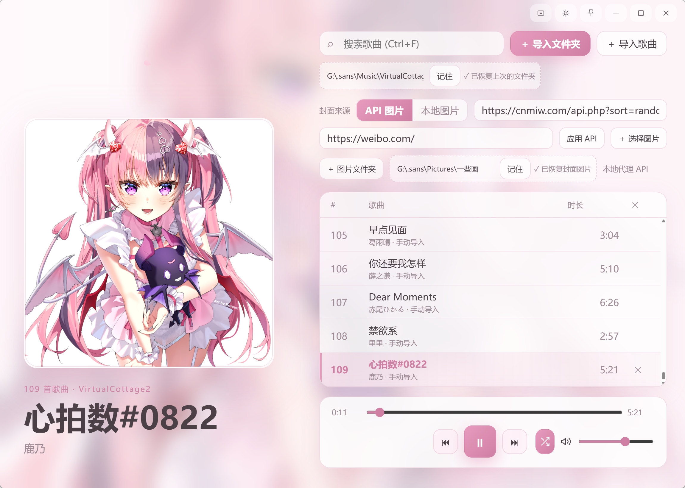
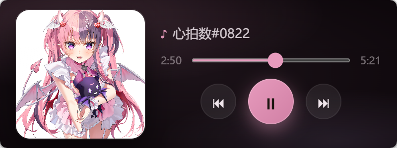
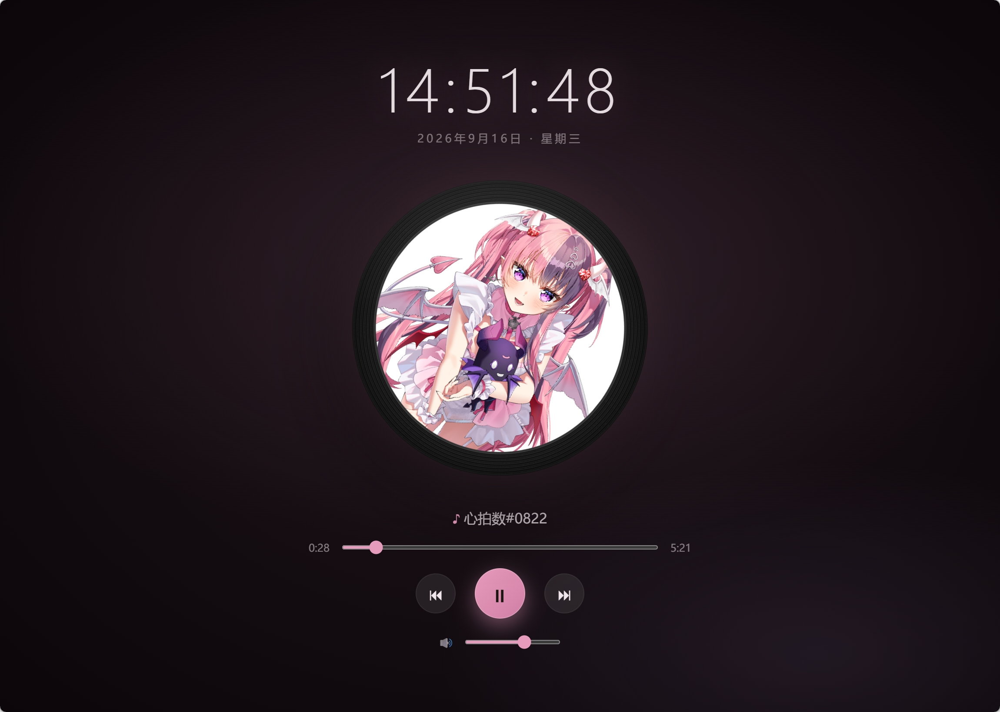
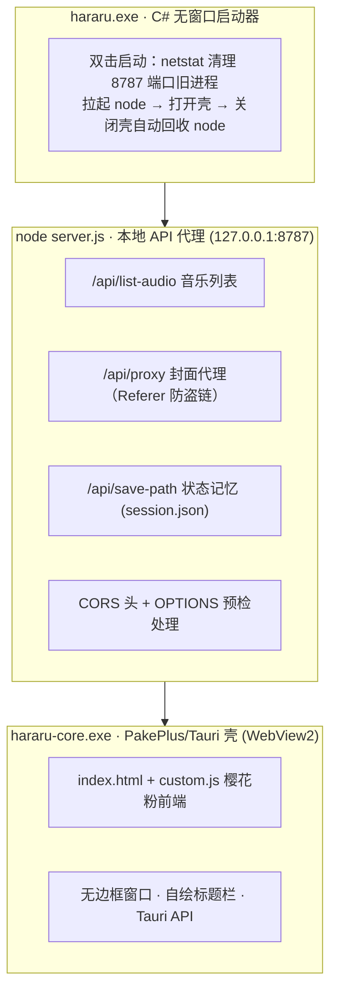

[README.md](https://github.com/user-attachments/files/32275518/README.md)
# 🌸 Hararu 樱花音乐播放器

一款 Windows 桌面音乐播放器。樱花粉少女风界面，支持本地音乐播放、随机封面展示、网易云 .uc 缓存解密，以及完整的状态记忆（音乐目录 / 封面目录 / 音量 / 循环模式重启自动恢复）。

由 **C# 无窗口启动器 + Node 本地 API 服务 + WebView2 桌面壳** 三层架构组成，全链路自研。

## ✨ 功能特性

- 🎵 **本地音乐播放**：加载本地音乐文件夹即播，附带网易云 .uc 缓存文件解密工具
- 🖼️ **随机封面**：每次切歌自动获取全新封面，支持图床防盗链（Referer 代理）与本地封面直连
- 💾 **状态记忆**：音乐目录、封面目录、音量、循环模式全部持久化，重启即恢复
- 🎮 **快捷键体系**：空格 播放/暂停 · 方向键 快进/快退 · `Alt+Enter` 全屏 · `Ctrl+M` 小窗专注模式
- 🔁 **循环三态**：列表循环 / 单曲循环 / 随机播放，右键菜单快捷切换
- 🪟 **无边框窗口**：自绘标题栏（SVG 细线按钮）、全局拖拽热区、窗口尺寸精确记忆
- 🌸 **樱花粉 UI**：柔和低饱和渐变 + 奶油白卡片 + 飘落花瓣动画，界面干净无干扰

## 📸 截图

在仓库根目录新建 `screenshots/` 文件夹，放入截图后 README 中会直接显示：







## 🧱 技术架构



**请求链路**：前端所有 API 请求走绝对路径 `http://127.0.0.1:8787/api/*` → node 代理处理跨域与鉴权 → 返回数据 / 代理图片。

## 📁 项目结构

```
hararu/
├── index.html            # 播放器前端（樱花粉 UI + 播放逻辑）
├── custom.js             # 前端注入脚本（快捷键、窗口控制、封面逻辑）
├── server.js             # Node 本地 API 代理（127.0.0.1:8787，CORS / 封面代理 / 状态记忆）
├── hararu-launcher.cs    # C# 无窗口启动器源码（node 生命周期管理）
├── config/
│   ├── www/              # 壳实际加载的前端资源
│   └── man               # PakePlus 壳配置（窗口 / 图标 / 调试）
├── hararu-core.exe       # PakePlus 2.2.8 壳（WebView2）
└── hararu.ico            # 应用图标（圆角樱花版）
```

## 🚀 快速开始

### 方式一：直接下载（推荐）

1. 前往 [Releases](../../releases) 下载最新压缩包
2. 解压后双击 **HararuPlayer.exe**（启动器）
3. 首次启动会自动拉起本地服务，无需任何配置

> 环境要求：Windows 10/11，需 WebView2 Runtime（Win11 系统自带，Win10 首次运行会自动安装）

### 方式二：从源码运行

```bash
# 启动本地 API 服务
node server.js

# 用任意 WebView2 容器加载 index.html，或使用 PakePlus 重新打包
```

## 🔧 技术要点

- **跨域方案**：前端与 API 服务跨端口，所有请求走绝对路径 + 服务端 CORS 头与 OPTIONS 预检，彻底解决 WebView2 下的跨域拦截
- **状态持久化**：WebView2 中 localStorage 不可靠，改为服务端 `session.json` 持久化，重启自动恢复
- **防盗链与缓存**：封面请求带 Referer 代理绕过图床防盗链，并加 `no-cache` 头保证每次切歌获取全新封面；本地服务地址直连跳过代理
- **进程管理**：C# 启动器用 netstat 定位并结束占用端口的旧进程，每次启动强制重启 node，杜绝"改了代码还是旧逻辑"的问题
- **窗口控制**：Tauri 物理/逻辑像素换算适配 DPI，关闭前尺寸校正解决窗口"每次启动变高 20px"的递增 bug，启动固定 1150×800
- **双图标方案**：exe 资源图标与运行时窗口/任务栏图标分离管理，均可独立替换

## 📜 许可证

MIT © [thesansurw](https://github.com/thesansurw)
